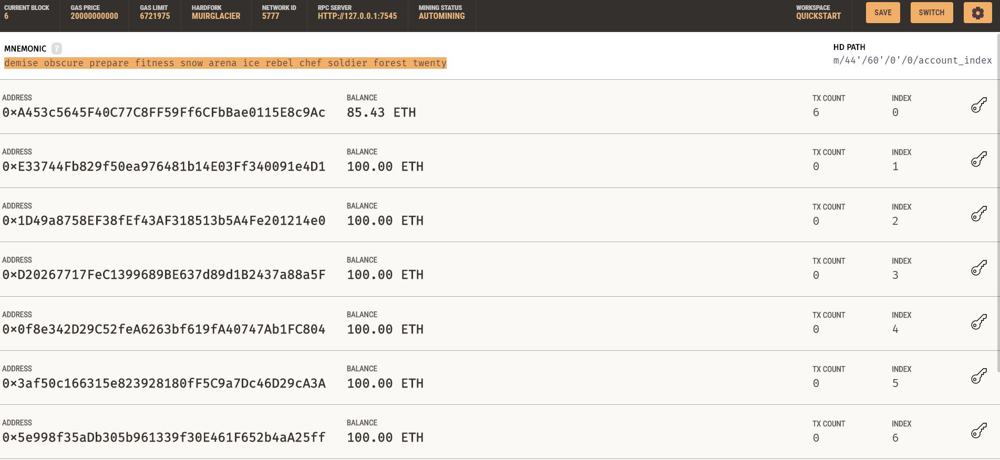

# Fintech-finder
 Integrating the Ethereum blockchain network into the application in order to enable your customers to instantly pay the fintech professionals whom they hire with cryptocurrency.
 
 This code is implementing a streamlit page that allows to pick a fintech professional. The purpose is to simulate a price based on a number of hours work (is determined by the user) for a choosen fintech professional. Once that the number of hour and the professional are decided, you can immideatly make a transfer in ETH. The wage is deducted from your ganache account once you click on transfer.
 
 The dashboard gives a binary form of the hash.
 
 
 Hereonder I joined two screenshots, the first one is the dashboard and the other one is the ganache account. The mnemonic comes from gancaches HD wallet. It is used as link with with the code and stored as .env.

